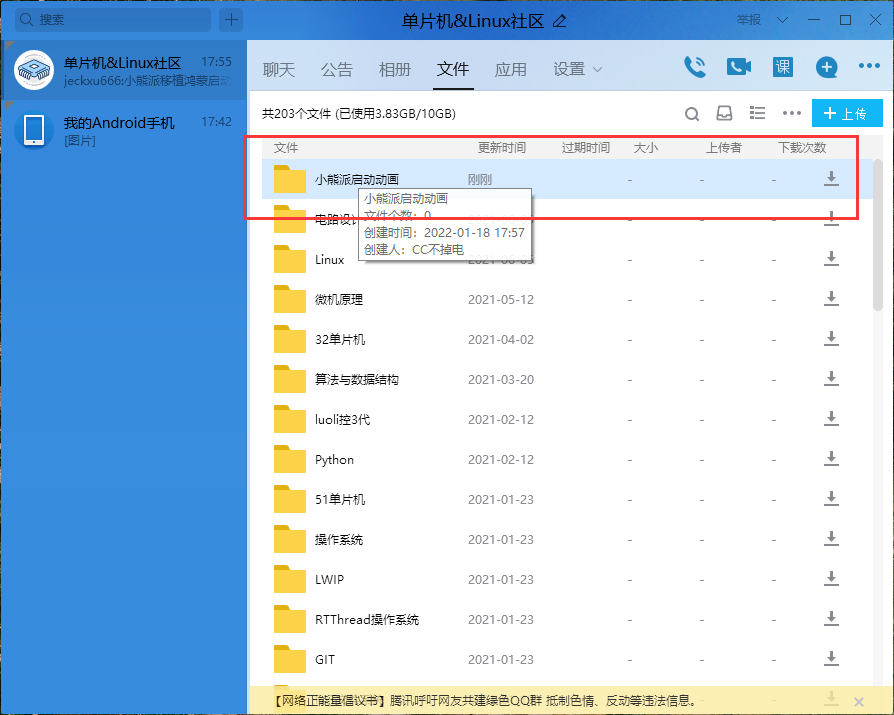
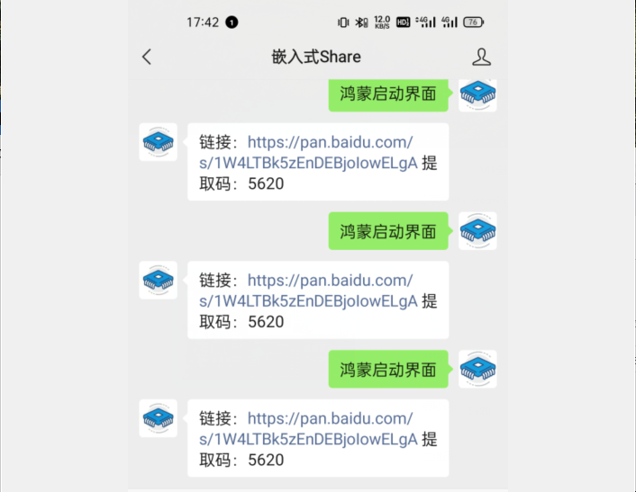

# HarmonyOS_Start_UI
Based on LiteOS &amp; LVGL realized the HarmonyOS Start UI

之前使用小熊派实现了鸿蒙动画的开机界面，具体使用的技术栈为 STM32 + LiteOS + LVGL + FATFS +DMA 方式实现，刷新效率非常高，预览视频如下：

关于这个的实现过程我会写一系列的教程分享出来，主要分为下面几个部分

- [x] 小熊派移植华为 LiteOS-M（基于MDK）：[链接](https://blog.csdn.net/qq_45396672/article/details/122396806)；
- [x] 小熊派基于 LiteOS 移植 LVGL 显示接口：[链接](https://blog.csdn.net/qq_45396672/article/details/122529954)；
- [x] 小熊派基于 LiteOS 移植 LVGL 文件系统：[链接](https://blog.csdn.net/qq_45396672/article/details/122559765)；
- [x] 小熊派实现鸿蒙开机界面（LiteOS+LVGL）：[链接]()；

代码获取

1. **Github：[链接](https://github.com/Ajie16/HarmonyOS_Start_UI)**

2. **QQ交流群：773080352**

   

3. **微信公众号：嵌入式Share**

   
